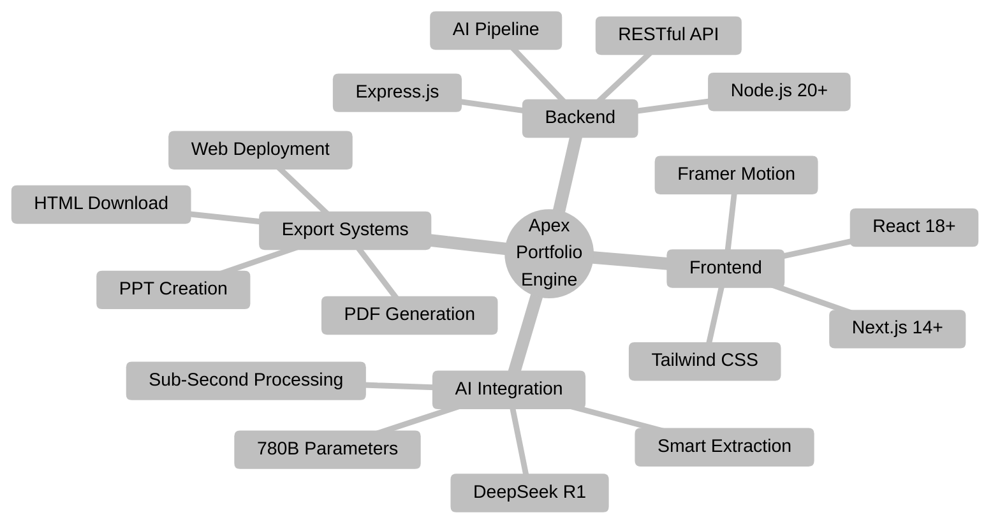

 

 

  
  
  
  
  

 

  

## What Makes Us Different

<table>
<tr>
<td align="center" width="33%">

### Lightning Fast
Build your portfolio in under 1 second with AI

</td>
<td align="center" width="33%">

### AI-Powered
Smart content generation & optimization

</td>
<td align="center" width="33%">

### Export Anywhere
PDF, PowerPoint & Web Deployment

</td>
</tr>
</table>

 

  

## Project Overview

Apex Portfolio Engine transforms professional portfolio creation through AI-powered automation. Built with DeepSeek R1 (780B parameters), it generates stunning, ATS-optimized portfolios in under one second from resume uploads.

 

## AI Intelligence

DeepSeek R1 with 780 billion parameters provides unprecedented natural language processing capabilities for context-aware resume parsing, intelligent content extraction, and industry-specific optimization.

 

  

  

## Technology Architecture

  

### Frontend Stack

React 18+ | Component-based architecture with optimized state management

Next.js 14+ | Server-side rendering, static generation, and API routes

Tailwind CSS | Utility-first styling for rapid development

Framer Motion | Production-grade animations and transitions

 

### Backend Stack

Node.js 20+ | Event-driven architecture for concurrent AI requests

Express.js | RESTful API design with middleware orchestration

DeepSeek R1 Integration | Custom AI pipeline with sub-second processing

Asynchronous Execution | Intelligent caching and batch processing

 

  

## Core Features

 

### Intuitive Landing Page

Sophisticated animations, micro-interactions, and conversion-optimized design elements based on A/B testing research.

 

### Professional Builder Interface

Six-step creation process with real-time validation, intelligent suggestions, contextual help, and seamless progression.

 

  

  

## The 6-Step Process

 

 

<table>
<tr>
<td align="center" width="33%">

### STEP 1
**Intelligent Upload**

Drag & drop resume
Format recognition

</td>
<td align="center" width="33%">

### STEP 2
**AI Extraction**

99.8% accuracy
Context-aware processing

</td>
<td align="center" width="33%">

### STEP 3
**Layout Selection**

Industry-optimized templates
Maximum visual impact

</td>
</tr>
<tr>
<td align="center" width="33%">

### STEP 4
**ATS Optimization**

90% compatibility
Smart keyword placement

</td>
<td align="center" width="33%">

### STEP 5
**Design Customization**

Professional palettes
Industry-specific styling

</td>
<td align="center" width="33%">

### STEP 6
**Export & Deploy**

PDF, PPT, Web, HTML
One-click deployment

</td>
</tr>
</table>

 

  

## Live Preview System

Real-time feedback during portfolio construction:

Instant Updates | Changes appear immediately in preview

Auto-Scroll Intelligence | Preview automatically focuses on edited sections

Side-by-Side Editing | Split-screen for desktop users

Visual Validation | WYSIWYG - spot issues before export

 

  

## Export Options

 

<table>
<tr>
<td align="center" width="25%">

High-resolution
Print-ready
Embedded fonts

</td>
<td align="center" width="25%">

Presentation slides
Interview ready
Auto-generated

</td>
<td align="center" width="25%">

Custom domains
SEO-optimized
Mobile-responsive

</td>
<td align="center" width="25%">

Clean code
Well-structured
Customizable

</td>
</tr>
</table>

 

  

## Tech Stack

 

### Frontend Technologies

 

### Backend Technologies

 

### Development Tools

  

<table>
<tr>
<td align="center" width="50%">

**Frontend**

</td>
<td align="center" width="50%">

**Backend**

</td>
</tr>
</table>

 

  

  

## Developer

 

  

<table>
<tr>
<td align="center">

### **Shreyansh Dangar**
#### Full Stack Developer

**Expertise**: AI Integration | React.js | Next.js | Node.js | Express.js | UI/UX Design

**Contributions**: Complete architecture, frontend development, backend infrastructure, AI pipeline integration, landing page design, builder interface, export systems, and deployment automation.

 

  

</td>
</tr>
</table>

 

  

# Quick Start

 

<table align="center" width="80%">
<tr>
<td align="center">

### Clone Repository
<pre><code>git clone https://github.com/ShreyanshDangar/apex-portfolio-engine.git</code></pre>

### Navigate to Directory
<pre><code>cd apex-portfolio-engine</code></pre>

### Install Dependencies
<pre><code>npm install</code></pre>

### Launch Development Server
<pre><code>npm run dev</code></pre>

### Build for Production
<pre><code>npm run build</code></pre>

### Start Production Server
<pre><code>npm start</code></pre>

</td>
</tr>
</table>

</td>
<td align="center" valign="middle">

</td>
</tr>
</table>

## Performance Metrics

 

<table>
<tr>
<td align="center">

### Speed
Build in **1 second**

vs Traditional: **5 hours**

</td>
<td align="center">

### Quality
**Professional** designs

Industry-optimized templates

</td>
<td align="center">

### AI Power
**Smart** automation

Context-aware generation

</td>
<td align="center">

### Value
**Free** to use

Open-source project

</td>
</tr>
</table>

 

  

  

 

  

---

 

  

  

